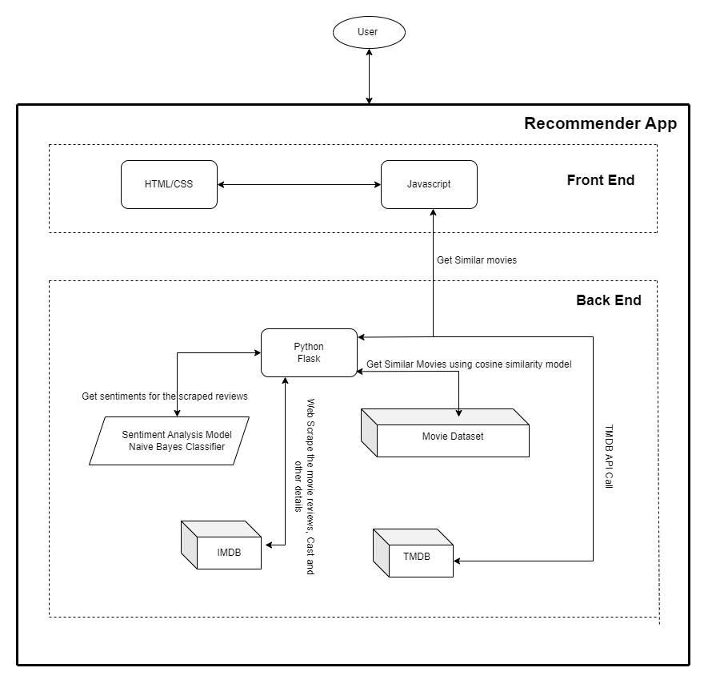

# 🎥 **Movie Recommendation System** 🎥  

[](https://doi.org/10.5281/zenodo.10212033)  
  
  
  
  
  
  
[](https://opensource.org/licenses/MIT)  
[](https://GitHub.com/se-zeus/popcorn_pal_2.0/)
[](https://GitHub.com/se-zeus/popcorn_pal_2.0/)
[](https://pypi.org/project/black/)
  

[](https://github.com/se-zeus/popcorn_pal_2.0.git)
[](https://github.com/se-zeus/popcorn_pal_2.0/graphs/contributors)
[](https://github.com/se-zeus/popcorn_pal_2.0/tags)
[](https://GitHub.com/se-zeus/popcorn_pal_2.0/)
[](https://GitHub.com/se-zeus/popcorn_pal_2.0/)

[](https://GitHub.com/se-zeus/popcorn_pal_2.0/)


[](https://www.python.org/dev/peps/pep-0008/)
---

## 📌 **Introduction**

This **Movie Recommendation System** is your ultimate movie companion. By leveraging **TMDB API**, advanced **cosine similarity**, and **sentiment analysis**, it provides **personalized movie suggestions** tailored to your preferences and moods. The platform's enhanced UI offers an interactive cinematic experience, bringing the magic of movies right to your fingertips. 

---
### Architecture of the Recommendation System 🏗️


---

## 🎬✨ **What’s New in Version 2.0?** ✨🎥  

The system has evolved significantly, integrating advanced features and modernizing the user experience:

### 🔄 **Evolution Snapshot: Old vs. New**
1. **Static to Dynamic Data**:
   - **Before**: Movie details were static with limited options.  
   - **Now**: Real-time updates via **dynamic web scraping**, fetching movie titles, cast details, genres, and visually appealing posters. Stay updated with the **latest releases**, creating a personalized and dynamic cinema experience.

2. **Enhanced Recommendations**:
   - **Before**: Recommendations were based only on cosine similarity.  
   - **Now**: A blend of **cosine similarity** and **sentiment analysis** ensures the suggestions resonate not just with your taste but also align with audience sentiments. This elevates the system from generic recommendations to **emotionally enriched suggestions**.

3. **Trending Movies Feature**:
   - Discover **trending movies** with a single click. A dedicated section now highlights popular and critically acclaimed films.

4. **User Following Feature**:
   - Follow users to explore their favorite movies and watchlists. Create a shared cinematic journey with friends and like-minded movie enthusiasts.

5. **UI Transformation**:
   - The interface has been revamped to resemble a **classic cinema website**, incorporating immersive designs and interactive elements.  
   - **New Features**:
     - Interactive posters with trailer playback.
     - Smooth navigation for exploring cast details, biographies, and movie reviews.

---

## 📌 **Key Features**

- **Trending Movies Section**: Stay updated on the latest trends in cinema.  
- **Personalized Recommendations**: Movies tailored to your taste and mood.  
- **Interactive Trailers**: Click on posters to watch trailers directly.  
- **Cast Exploration**: Learn about actors’ journeys, from birthdays to biographies.  
- **Follow Users**: Share recommendations and explore common interests.  
- **Dynamic Updates**: Constantly evolving database with real-time scraping.  

---

## 📚 **How to Run the Project?**

### Setting Up Multiple Python Environments (3.6 and 3.10)
Some dependencies may not be compatible with Python 3.6. It is recommended to create separate environments to ensure smooth functionality.

### Steps:

1. **Clone the Repository**:
   ```bash
   git clone https://github.com/se-zeus/popcorn_pal_2.0.git
   cd popcorn_pal_2.0
   ```

2. **Set Up Python 3.6 Environment**:
   ```bash
   conda create --name movie_env_36 python=3.6
   conda activate movie_env_36
   pip install -r requirements_36.txt
   ```

3. **Set Up Python 3.10 Environment**:
   ```bash
   conda create --name movie_env_310 python=3.10
   conda activate movie_env_310
   pip install -r requirements_310.txt
   ```

4. **Modify TMDB API Key**:
   Replace `YOUR_API_KEY` in `static/recommend.js` (lines 15 and 29) with your TMDB API key.

5. **Run the Application**:
   - Activate the desired environment:
     ```bash
     conda activate movie_env_310  # Or movie_env_36
     ```
   - Start the server:
     ```bash
     python main.py
     ```
   - Open [http://127.0.0.1:5000/](http://127.0.0.1:5000/) in your browser.

---

## 📷 **Screenshots**  
### **Home Page**
*(Insert screenshot of the updated home page)*

### **Trending Movies Section**
*(Insert screenshot of trending movies page)*

### **Movie Details**
*(Insert screenshot of movie details page)*

### **Recommendations**
*(Insert screenshot of recommendations page)*

### **Trailer Interaction**
*(Insert GIF of interactive trailer feature)*

---
## ▶️ **Demo Video**  
[](https://www.youtube.com/watch?v=2FKQk8rXWFg)

## 📊 **Datasets Used**

1. [TMDB Dataset](https://www.kaggle.com/rounakbanik/the-movies-dataset)  
2. [IMDB Movie Dataset](https://www.kaggle.com/carolzhangdc/imdb-5000-movie-dataset)  
3. [Movie Lists (2018-2023)](https://en.wikipedia.org/)  

---

## 🔍 **Technical Details**

### **Cosine Similarity**:
Cosine similarity is used to measure the similarity between movie metadata. It computes the cosine of the angle between two vectors, representing the text features of movies.

### **Sentiment Analysis**:
Analyzes user reviews to gauge positive or negative sentiments, enriching recommendations with audience feedback.

---

## 🔮 **Future Roadmap**

1. **Social Features**:
   - Enable users to create watchlists and share them with friends.  

2. **Advanced AI Models**:
   - Incorporate neural networks for even more accurate recommendations.  

3. **Mobile App Integration**:
   - Launch a mobile-friendly version of the platform.  

4. **Expanded User Profiles**:
   - Enable personalized watch history and advanced filtering options.  

---

## 🐞 **Bug Reporting**
If you encounter any issues, please [raise an issue here](https://github.com/se-zeus/popcorn_pal_2.0/issues/new).  

---

## 👥 **Contributors**

<table>
  <tr>
    <td align="center"><a href="https://github.com/Anjan50"><br /><sub><b>Anjan Diyora</b></sub></a></td>
    <td align="center"><a href="https://github.com/m11dedhia"><br /><sub><b>Medh Dedhia</b></sub></a></td>
  </tr>
</table>

---
